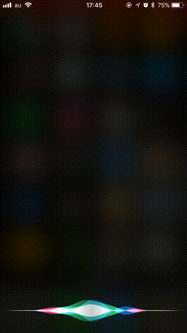
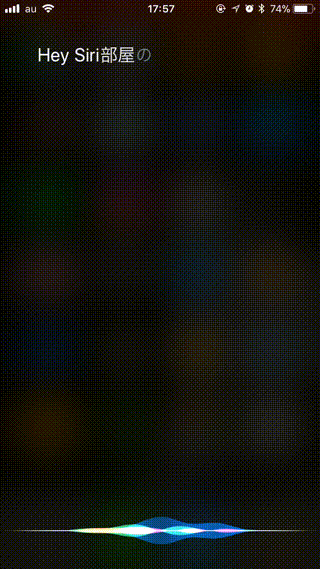
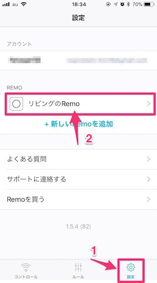
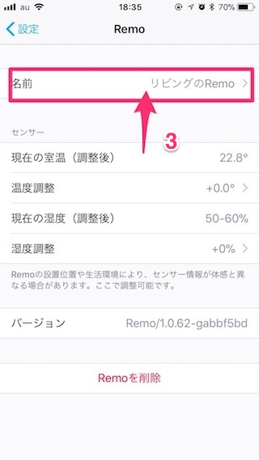

# homebridge-nature-remo-sensor

Nature Remo plugin for homebridge: https://github.com/nfarina/homebridge

## feature

SiriとHomekit(iOSのHomeアプリ)でNatureRemoのセンサー値を取得するためのhomebridgeプラグインです。





本プラグインは『Nature Remo Cloud API』を使用してNatureRemoの温度と湿度、照度を取得します。

そのため、[home.nature.global](https://home.nature.global/)より取得できる、OAuth2のアクセストークンが必要です。

＃ 『Nature Remo Local API』には温度と湿度、照度を取得できるAPIがv1.0.0にはないので『Nature Remo Cloud API』を使っています。  
＃ また、Homeアプリでは温度や湿度、照度センサーをトリガーとしたオートメーションを作成することができないようです（iOS11で確認）  
＃ Elgato Eveアプリなどサードパーティアプリを使えばできるみたいです（未確認）


## Installation

```shell
npm install homebridge-nature-remo-sensor -g
```

## Configuration

### 1. Get Nature-Remo OAuth2 Access Token

Issue at [home.nature.global](https://home.nature.global/)

### 2. Set & Get Nature-Remo DeivceNickName from Remo app

Remo app → Setting → Remo → Name





### 3. Create the config.json file
```shell
$ vim ~/.homebridge/config.json
```

```js
{
  "bridge": {
    "name": "Homebridge",
    "username": "CC:22:3D:E3:CE:30",
    "port": 51826,
    "pin": "031-45-154"
  },
  "description": "Nature Remo Control",
  "accessories": [{
    "accessory": "remo-sensor",
    "name": "センサー",
    "deviceName": "<DeivceNickName>",
    "mini": false,
    "schedule": "*/5 * * * *",
    "accessToken": "<https://home.nature.global/で取得したAccess token>"
  }]
}
```

Note:
* `schedule` is cron syntax
* `mini` must be `true` for Nature Remo mini
